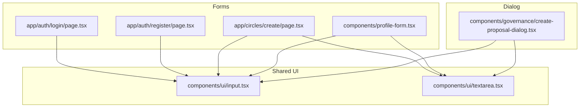

# Design Document

## Overview

This pass makes the authentication forms, circle creation form, profile form, and governance dialog meet WCAG 2.1 AA baseline for keyboard and screen-reader users. The changes are surgical: no new libraries, no architectural shifts. The work falls into three buckets:

1. **ARIA wiring** — propagate `aria-invalid` and `aria-describedby` from validation state to the DOM on every form.
2. **Component upgrade** — update `components/ui/input.tsx` to forward ARIA props, and migrate `create-proposal-dialog.tsx` from raw HTML elements to the shared component.
3. **Focus ring audit** — ensure no global CSS suppresses `:focus-visible` outlines below 2 px.

Dialog focus management is already handled correctly by Radix UI (`components/ui/dialog.tsx`) and the custom `components/modal.tsx`. No changes are needed there.

---

## Architecture

The change is purely at the component/presentation layer. No API routes, data models, or server-side logic are affected.



Each form already owns its own validation state (`errors` object or react-hook-form `formState.errors`). The only change is threading that state through to ARIA attributes and stable error-region `id`s.

---

## Components and Interfaces

### `components/ui/input.tsx` — ARIA prop forwarding

The component already spreads `...props` onto the underlying `<input>`, so `aria-invalid` and `aria-describedby` already pass through today. The gap is that consuming forms never pass them. No change to the component itself is strictly required, but we will verify the spread is unconditional and document the expected usage contract.

Expected usage after this pass:

```tsx
<Input
  id="email"
  name="email"
  aria-invalid={!!errors.email}
  aria-describedby={errors.email ? "email-error" : undefined}
/>
{errors.email && (
  <p id="email-error" role="alert" className="text-sm text-destructive">
    {errors.email}
  </p>
)}
```

The `role="alert"` on the error paragraph causes screen readers to announce the message immediately when it appears, without requiring the user to re-focus the field.

### Auth forms (`login/page.tsx`, `register/page.tsx`)

Both forms use a hand-rolled `errors: Record<string, string>` state. The pattern to apply to every field:

- Add `aria-invalid={!!errors[fieldName]}` to the `<Input>`.
- Add `aria-describedby={errors[fieldName] ? \`${fieldName}-error\` : undefined}` to the `<Input>`.
- Add `id={\`${fieldName}-error\`}` and `role="alert"` to the error `<p>`.

### Circle form (`app/circles/create/page.tsx`)

Same hand-rolled pattern as auth forms. Same fix applies to all five validated fields: `name`, `contributionAmount`, `contributionFrequencyDays`, `maxRounds`. The `description` textarea has no validation, so no ARIA wiring is needed there.

### Profile form (`components/profile-form.tsx`)

Uses react-hook-form. The `register()` spread does not include ARIA attributes. The fix:

```tsx
<Input
  id="firstName"
  {...register('firstName')}
  aria-invalid={!!errors.firstName}
  aria-describedby={errors.firstName ? "firstName-error" : undefined}
/>
{errors.firstName && (
  <p id="firstName-error" role="alert" className="text-sm text-destructive">
    {errors.firstName.message}
  </p>
)}
```

Fields: `firstName`, `lastName`, `username`, `notificationEmail`, `bio`.

### Governance dialog (`components/governance/create-proposal-dialog.tsx`)

Currently uses raw `<input>`, `<textarea>`, and `<select>` elements with a single shared `error` string (not per-field). The migration:

1. Replace raw `<input>` elements with `<Input>` from `components/ui/input.tsx`.
2. Replace raw `<textarea>` with `<Textarea>` from `components/ui/textarea.tsx`.
3. Convert the single `error` string to a per-field `errors: Record<string, string>` object (same pattern as auth forms).
4. Wire `aria-invalid` and `aria-describedby` on each field.
5. Add per-field error `<p>` elements with matching `id`s and `role="alert"`.

The `<select>` for proposal type has no validation rule that can fail, so no ARIA wiring is needed there. The quorum `<input type="range">` also has no validation error state.

### Focus rings

The `Input` component already applies `focus-visible:ring-[3px]` via Tailwind, which exceeds the 2 px minimum. The raw elements in the governance dialog use `focus:ring-2` (8 px by default in Tailwind, which is 2 px outline equivalent). After migrating to shared components, focus rings are consistent.

A global CSS audit is needed to confirm no `outline: none` rule on `:focus` exists without a `:focus-visible` replacement. This is a one-time check in `app/globals.css` and any other global stylesheet.

### Dialog focus management

No changes required:
- `components/ui/dialog.tsx` — Radix `Dialog` handles focus trap, initial focus, return focus, and Escape key natively.
- `components/modal.tsx` — already implements a manual focus trap, Escape handler, and backdrop close.

---

## Data Models

No new data models. The only state change is in `create-proposal-dialog.tsx`: the single `error: string` becomes `errors: Record<string, string>` to support per-field error regions.

```ts
// Before
const [error, setError] = useState('');

// After
const [errors, setErrors] = useState<Record<string, string>>({});
```

The validation logic in `handleSubmit` is refactored to populate individual keys instead of a single string.

---

## Error Handling

- If a field fails validation, its error key is set in the `errors` map and the corresponding `<p id="...">` renders with `role="alert"`.
- If a field passes validation after previously failing, its error key is cleared (set to `''` or deleted), which causes the error `<p>` to unmount or render empty — preventing stale announcements.
- The `role="alert"` attribute triggers an ARIA live region announcement when the element is inserted into the DOM, so screen readers announce the error without requiring re-focus.
- For the governance dialog, the existing catch block that sets a generic error message is preserved; it maps to a form-level error region rather than a field-level one.

---

## Correctness Properties

*A property is a characteristic or behavior that should hold true across all valid executions of a system — essentially, a formal statement about what the system should do. Properties serve as the bridge between human-readable specifications and machine-verifiable correctness guarantees.*

### Property 1: Invalid fields carry matching ARIA error references

*For any* form component (Auth_Form, Circle_Form, Profile_Form, Governance_Dialog) and any field name that has a non-empty validation error, the rendered `<input>` (or equivalent) element should have `aria-invalid="true"` and an `aria-describedby` value that exactly matches the `id` of the rendered error element.

**Validates: Requirements 1.1, 1.2, 1.3, 1.4, 1.5, 1.6, 1.7, 1.8, 2.1, 2.2, 2.3, 2.4**

### Property 2: Clearing a validation error removes aria-invalid

*For any* form component and any field that previously had `aria-invalid="true"`, after the error is cleared (field passes validation), the rendered element should have `aria-invalid` absent or set to `"false"`.

**Validates: Requirements 1.9, 1.10, 1.11, 1.12**

### Property 3: No stale error regions when field is valid

*For any* form component and any field with no current validation error, the DOM should contain no visible or non-empty element with the id that would be referenced by that field's `aria-describedby`.

**Validates: Requirements 2.5, 2.6, 2.7, 2.8**

### Property 4: All interactive form elements are keyboard-reachable

*For any* form component, every rendered `<input>`, `<textarea>`, `<select>`, and `<button>` element should have a `tabIndex` of `0` or no explicit `tabIndex` (browser default), and none should have `tabIndex="-1"` unless it is intentionally excluded from tab order by design.

**Validates: Requirements 4.1, 4.2, 4.3, 4.4**

### Property 5: Input component forwards ARIA props to the underlying element

*For any* combination of `aria-invalid`, `aria-describedby`, and `aria-label` prop values passed to the `Input` component, those exact values should appear as attributes on the rendered `<input>` DOM element.

**Validates: Requirements 7.1, 7.2**

---

## Testing Strategy

### Dual testing approach

Both unit/example tests and property-based tests are required. They are complementary:

- Unit/example tests catch concrete bugs at specific inputs and verify integration points.
- Property-based tests verify universal invariants across randomly generated inputs, catching edge cases that hand-written examples miss.

### Property-based testing

Use **fast-check** (TypeScript-native, works with Vitest/Jest) for all property tests.

Each property test must run a minimum of **100 iterations**.

Tag format for each test:
```
// Feature: accessibility-pass, Property N: <property text>
```

| Property | Test description | fast-check arbitraries |
|---|---|---|
| P1 | For any field name + error string, rendered input has aria-invalid=true and aria-describedby matching error element id | `fc.string()` for field name, `fc.string({ minLength: 1 })` for error message |
| P2 | For any field that had an error, clearing it removes aria-invalid | Same arbitraries, two-phase render |
| P3 | For any field with no error, no non-empty error element exists in DOM | `fc.string()` for field name, render with empty errors map |
| P4 | For any form render, all interactive elements have tabIndex ≥ 0 | Render with `fc.record(...)` of form state values |
| P5 | For any aria prop values, Input forwards them to the DOM element | `fc.string()` for aria-describedby, `fc.boolean()` for aria-invalid |

### Unit / example tests

Focus on:
- Specific validation scenarios (empty field, too-short value, invalid email format)
- Dialog focus management: open → focus moves in; close → focus returns to trigger; Escape closes; backdrop click closes
- axe scans per route: `/auth/login`, `/auth/register`, `/circles/create`, governance dialog route, profile form route — assert zero critical/serious violations using **jest-axe** or **@axe-core/playwright**
- `Input` component with `aria-invalid="true"` renders the destructive ring CSS class

Avoid writing exhaustive unit tests for every field/form combination — the property tests cover that space.

### Test file locations

```
__tests__/
  accessibility/
    aria-wiring.property.test.tsx   # Properties 1–4
    input-component.property.test.tsx  # Property 5
    dialog-focus.test.tsx           # Dialog focus examples
    axe-audit.test.tsx              # Per-route axe scans
```

### axe configuration

```ts
import { axe, toHaveNoViolations } from 'jest-axe';
expect.extend(toHaveNoViolations);

// Filter to critical and serious only
const results = await axe(container, {
  runOnly: { type: 'tag', values: ['wcag2a', 'wcag2aa'] },
});
const criticalOrSerious = results.violations.filter(
  (v) => v.impact === 'critical' || v.impact === 'serious'
);
expect(criticalOrSerious).toHaveLength(0);
```
