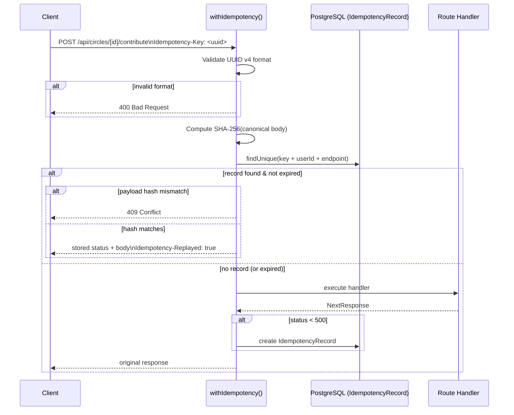

# Design Document: Idempotency Key Support

## Overview

This feature adds idempotency key support to the two mutation endpoints — `POST /api/circles/[id]/contribute` and `POST /api/circles/[id]/join`. A client supplies an `Idempotency-Key` UUID v4 header; the server persists the key alongside the serialized response and replays it on duplicate requests within a 24-hour TTL window. This prevents double-applied contributions or duplicate join records caused by network retries.

The implementation is a thin higher-order function `withIdempotency()` in `lib/idempotency.ts` that wraps existing route handlers with no changes to their internal logic.

## Architecture



The wrapper intercepts the request before the handler runs, and intercepts the response before it is sent to the client. The route handlers themselves are unchanged.

## Components and Interfaces

### `lib/idempotency.ts`

The single new file. Exports one public function:

```typescript
/**
 * Wraps a Next.js App Router POST handler with idempotency semantics.
 *
 * @param handler  The original route handler function.
 * @param endpoint A stable string identifying the route, e.g. "/api/circles/contribute".
 */
export function withIdempotency(
  handler: RouteHandler,
  endpoint: string,
): RouteHandler
```

Internal helpers (not exported):

```typescript
/** Returns true when the string is a valid UUID v4. */
function isValidUuidV4(value: string): boolean

/** Returns the SHA-256 hex digest of the canonical JSON body string. */
async function hashPayload(body: string): Promise<string>

/** Reads TTL from IDEMPOTENCY_TTL_SECONDS env var; falls back to 86400 (24 h). */
function getTtlSeconds(): number
```

Type aliases used internally:

```typescript
type RouteHandler = (
  request: NextRequest,
  context: { params: Promise<{ id: string }> },
) => Promise<NextResponse>
```

### Route handler integration

Each route handler is wrapped at the export site — no changes inside the handler body:

```typescript
// app/api/circles/[id]/contribute/route.ts
import { withIdempotency } from '@/lib/idempotency';

async function POST(request, context) { /* unchanged */ }

export { withIdempotency(POST, '/api/circles/contribute') as POST }
```

The same pattern applies to the join route.

### Prisma model — `IdempotencyRecord`

Added to `prisma/schema.prisma`:

```prisma
model IdempotencyRecord {
  id           String   @id @default(cuid())
  key          String
  userId       String
  endpoint     String
  payloadHash  String
  responseBody Json
  statusCode   Int
  expiresAt    DateTime

  @@unique([key, userId, endpoint])
  @@index([expiresAt])
}
```

No foreign-key relation to `User` is added intentionally — idempotency records are ephemeral audit rows and should survive user deletion without cascading.

## Data Models

### IdempotencyRecord fields

| Field          | Type       | Description                                                  |
|----------------|------------|--------------------------------------------------------------|
| `id`           | `String`   | CUID primary key                                             |
| `key`          | `String`   | Client-supplied UUID v4                                      |
| `userId`       | `String`   | Authenticated user ID (from JWT); scopes the key             |
| `endpoint`     | `String`   | Stable route identifier, e.g. `/api/circles/contribute`      |
| `payloadHash`  | `String`   | SHA-256 hex digest of the canonical request body             |
| `responseBody` | `Json`     | Serialized response body stored as Prisma `Json`             |
| `statusCode`   | `Int`      | HTTP status code of the original response                    |
| `expiresAt`    | `DateTime` | `now + TTL`; records past this timestamp are treated as new  |

### Lookup key

The composite unique constraint `(key, userId, endpoint)` is the lookup key. This ensures:
- Keys are scoped per user (different users can use the same UUID without conflict).
- The same user can reuse a UUID on a different endpoint without collision.

### TTL configuration

```
TTL_SECONDS = parseInt(process.env.IDEMPOTENCY_TTL_SECONDS ?? '86400', 10)
expiresAt   = new Date(Date.now() + TTL_SECONDS * 1000)
```

### Payload hash

The hash is computed over the raw request body string (before JSON parsing) using the Web Crypto API available in the Next.js edge/Node runtime:

```typescript
const buf = await crypto.subtle.digest('SHA-256', new TextEncoder().encode(rawBody));
const hex = Array.from(new Uint8Array(buf)).map(b => b.toString(16).padStart(2, '0')).join('');
```

Using the raw body string (rather than a re-serialized object) avoids key-ordering ambiguity.

### Response storage

The response body is read once via `response.json()` and stored in the `responseBody` Json column. On replay, `NextResponse.json(record.responseBody, { status: record.statusCode })` reconstructs the response and the `Idempotency-Replayed: true` header is appended.

## Correctness Properties


*A property is a characteristic or behavior that should hold true across all valid executions of a system — essentially, a formal statement about what the system should do. Properties serve as the bridge between human-readable specifications and machine-verifiable correctness guarantees.*

### Property 1: UUID v4 validation partitions inputs correctly

*For any* string value supplied as the `Idempotency-Key` header, the middleware should accept it (proceed to handler) if and only if it is a valid UUID v4; all other strings should produce a 400 response.

**Validates: Requirements 1.1, 1.3**

### Property 2: User-scoped key isolation

*For any* two distinct authenticated users A and B and any UUID v4 key K, a stored idempotency record created by user A under key K should have no effect on the behavior of a request from user B using the same key K — user B's request should execute the handler as if no record exists.

**Validates: Requirements 1.4**

### Property 3: Replay returns stored response with Idempotency-Replayed header

*For any* valid idempotency key and any non-expired stored record matching that key, user, and endpoint, every subsequent duplicate request should receive the stored status code and response body, and the response must include the `Idempotency-Replayed: true` header.

**Validates: Requirements 2.1, 2.2, 2.3**

### Property 4: No database writes occur during replay

*For any* replayed request (matching key, user, endpoint, and payload hash), the number of rows written to the `IdempotencyRecord` table should be zero — the record count before and after the replay request must be equal.

**Validates: Requirements 2.4**

### Property 5: Conflicting payload returns 409 and leaves record unchanged

*For any* two distinct request bodies B1 and B2 (where SHA-256(B1) ≠ SHA-256(B2)), if a record was created with body B1 under key K, then a subsequent request with the same key K but body B2 should return 409, and the stored record should be byte-for-byte identical to the record before the conflicting request.

**Validates: Requirements 3.1, 3.3**

### Property 6: Successful request persists a complete IdempotencyRecord

*For any* request carrying a valid idempotency key that results in a non-5xx response, the persisted `IdempotencyRecord` should contain the correct key, userId, endpoint, payloadHash, responseBody, statusCode, and an `expiresAt` timestamp equal to the request time plus the configured TTL (within a small tolerance).

**Validates: Requirements 4.1, 5.1, 5.3**

### Property 7: 5xx responses do not persist records

*For any* handler that returns a 5xx status code, no `IdempotencyRecord` row should be created — the record count before and after the request must be equal.

**Validates: Requirements 4.2**

### Property 8: 4xx responses (non-409) persist records and replay on retry

*For any* handler that returns a 4xx status code (excluding 409), an `IdempotencyRecord` should be created, and a subsequent duplicate request should replay the same 4xx response without invoking the handler again.

**Validates: Requirements 4.3**

### Property 9: Expired records are treated as new

*For any* idempotency key K with a stored record whose `expiresAt` is in the past, a new request with key K should execute the handler as if no record exists, and a fresh record should be created.

**Validates: Requirements 5.2**

### Property 10: Contribute replay does not create additional Contribution rows

*For any* contribute request that is successfully processed and stored, replaying the same request should leave the `Contribution` table row count unchanged.

**Validates: Requirements 6.3**

### Property 11: Join replay does not create additional CircleMember rows

*For any* join request that is successfully processed and stored, replaying the same request should leave the `CircleMember` table row count unchanged.

**Validates: Requirements 6.4**

## Error Handling

| Scenario | HTTP Status | Response body | Record written? |
|---|---|---|---|
| Missing `Idempotency-Key` header | — (pass-through) | handler's response | yes (if non-5xx) |
| Invalid UUID v4 format | 400 | `{ error: "InvalidIdempotencyKey", message: "..." }` | no |
| Duplicate key, same payload, non-expired | stored code | stored body + `Idempotency-Replayed: true` | no |
| Duplicate key, different payload, non-expired | 409 | `{ error: "IdempotencyConflict", message: "..." }` | no (record unchanged) |
| Duplicate key, expired record | — (pass-through) | handler's response | yes (new record) |
| Handler returns 5xx | 5xx | handler's response | no |
| Handler returns 4xx (not 409) | 4xx | handler's response | yes |

The wrapper must not swallow handler errors. If `response.json()` throws while reading the handler response for storage, the original response is returned to the client and the record write is skipped (fail-open on storage, not on response).

## Testing Strategy

### Dual testing approach

Both unit/integration tests and property-based tests are required. Unit tests cover specific examples and integration sequences; property tests verify universal invariants across randomized inputs.

### Property-based testing

Use **fast-check** (already compatible with Jest/Vitest in Next.js projects) for all property tests. Each test runs a minimum of **100 iterations**.

Each property test must be tagged with a comment in this format:
```
// Feature: idempotency-key, Property <N>: <property_text>
```

Property tests to implement (one test per property):

| Test | Property | fast-check arbitraries |
|---|---|---|
| UUID validation partitions inputs | P1 | `fc.string()` + `fc.uuid()` |
| User-scoped key isolation | P2 | `fc.uuid()`, two distinct `fc.string()` userIds |
| Replay returns stored response | P3 | `fc.uuid()`, `fc.record({ status, body })` |
| No DB writes on replay | P4 | `fc.uuid()`, `fc.jsonValue()` |
| Conflict returns 409, record unchanged | P5 | `fc.uuid()`, two distinct `fc.jsonValue()` bodies |
| Record persisted with correct fields | P6 | `fc.uuid()`, `fc.integer({ min: 200, max: 499 })` |
| 5xx does not persist record | P7 | `fc.uuid()`, `fc.integer({ min: 500, max: 599 })` |
| 4xx persists and replays | P8 | `fc.uuid()`, `fc.integer({ min: 400, max: 499 })` excluding 409 |
| Expired record treated as new | P9 | `fc.uuid()`, past `Date` |
| Contribute replay: no extra Contribution row | P10 | `fc.uuid()` |
| Join replay: no extra CircleMember row | P11 | `fc.uuid()` |

### Unit / integration tests

Focus on the end-to-end retry sequence using a real (test) database or Prisma mock:

1. First request → handler executes → record created → 201 returned
2. Second request (same key + body) → handler NOT called → 201 replayed → `Idempotency-Replayed: true` present
3. Second request (same key, different body) → 409 → record unchanged
4. Request after TTL expiry → handler executes again → new record created
5. Request with no header → handler executes normally → no record created
6. Handler throws 500 → no record created → client receives 500

### Test file locations

```
__tests__/idempotency/
  withIdempotency.unit.test.ts       # unit tests for lib/idempotency.ts helpers
  withIdempotency.property.test.ts   # fast-check property tests (P1–P11)
  contribute.integration.test.ts     # end-to-end retry sequence for contribute
  join.integration.test.ts           # end-to-end retry sequence for join
```
