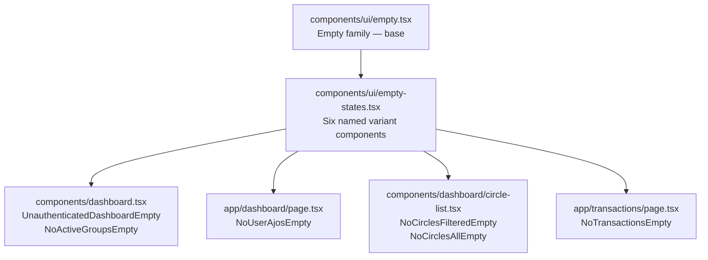

# Design Document: Rich Empty States

## Overview

This feature replaces the ad-hoc, inline empty-state markup scattered across three surfaces — the Dashboard, the Transactions page, and the Circles browser — with a consistent, accessible, and theme-aware set of empty state components. Each variant is built on top of the existing `Empty` component family in `components/ui/empty.tsx` and exposes a clear icon, a short title, a brief description, and one or two CTA buttons that guide the user toward the next meaningful action.

The six variants to implement are:

| Variant | Surface | Trigger condition |
|---|---|---|
| `UnauthenticatedDashboard` | `components/dashboard.tsx` | `isConnected === false` |
| `NoActiveGroups` | `components/dashboard.tsx` | `isConnected && activeGroups.length === 0` |
| `NoUserAjos` | `app/dashboard/page.tsx` | `isConnected && userAjos.length === 0` |
| `NoCirclesFiltered` | `components/dashboard/circle-list.tsx` | `circles.length === 0 && (searchQuery || statusFilter)` |
| `NoCirclesAll` | `components/dashboard/circle-list.tsx` | `circles.length === 0 && !searchQuery && !statusFilter` |
| `NoTransactions` | `app/transactions/page.tsx` | `transactions.length === 0` |

The design avoids introducing new component abstractions beyond what is strictly necessary. All six variants are implemented as named exports from a single new file, `components/ui/empty-states.tsx`, which composes the existing `Empty` family.

---

## Architecture

The feature is purely presentational — no new API routes, no new data-fetching hooks, and no changes to the application's routing or state management. The changes are confined to:

1. **`components/ui/empty-states.tsx`** — new file containing the six variant components.
2. **`components/ui/empty.tsx`** — minor extension: `EmptyTitle` is changed from a `<div>` to an `<h3>` (or given `role="heading" aria-level="3"`) to satisfy the accessibility heading requirement.
3. **`components/dashboard.tsx`** — replace the two inline empty-state blocks with `<UnauthenticatedDashboardEmpty>` and `<NoActiveGroupsEmpty>`.
4. **`app/dashboard/page.tsx`** — replace the inline "no ajos" block with `<NoUserAjosEmpty>`.
5. **`components/dashboard/circle-list.tsx`** — replace the inline empty-state block with `<NoCirclesFilteredEmpty>` or `<NoCirclesAllEmpty>` based on filter state; accept `searchQuery` and `statusFilter` as new props.
6. **`app/transactions/page.tsx`** — replace the inline empty-state block with `<NoTransactionsEmpty>`.



---

## Components and Interfaces

### Extension to `EmptyTitle` in `components/ui/empty.tsx`

The current `EmptyTitle` renders a `<div>`. To satisfy the heading accessibility requirement (Requirement 10.3), it must render as a semantic heading. The simplest change is to render an `<h3>` by default while keeping the existing class names:

```tsx
function EmptyTitle({ className, ...props }: React.ComponentProps<'h3'>) {
  return (
    <h3
      data-slot="empty-title"
      className={cn('text-lg font-medium tracking-tight', className)}
      {...props}
    />
  )
}
```

This is a non-breaking change because the component accepts arbitrary HTML attributes and the visual output is identical.

### `components/ui/empty-states.tsx`

Each variant is a zero-prop (or minimal-prop) component that composes the `Empty` family. Variants that need interactive behavior (wallet connect, clear filters, navigation) accept callbacks or use `next/link` directly.

#### Prop interfaces

```ts
// Unauthenticated dashboard — needs wallet connect callback
interface UnauthenticatedDashboardEmptyProps {
  onConnect: () => void;
  isConnecting?: boolean;
}

// No active groups — navigation only, no callbacks needed
// (uses next/link internally)
interface NoActiveGroupsEmptyProps {}

// No user ajos — navigation only
interface NoUserAjosEmptyProps {}

// No circles (filtered) — needs a reset callback
interface NoCirclesFilteredEmptyProps {
  onClearFilters: () => void;
}

// No circles (all) — navigation only
interface NoCirclesAllEmptyProps {}

// No transactions — navigation only
interface NoTransactionsEmptyProps {}
```

#### Icon selection

Each variant uses a single Lucide icon from the set already imported elsewhere in the project:

| Variant | Icon | Rationale |
|---|---|---|
| `UnauthenticatedDashboard` | `Wallet` | Directly represents the wallet connection action |
| `NoActiveGroups` | `Users` | Represents a savings group / circle |
| `NoUserAjos` | `CircleDot` | Represents an Ajo circle |
| `NoCirclesFiltered` | `SearchX` | Represents a failed search |
| `NoCirclesAll` | `LayoutGrid` | Represents the circles grid (already used in circle-list.tsx) |
| `NoTransactions` | `Receipt` | Represents a financial transaction |

All icons receive `aria-hidden="true"` as required by Requirement 10.2.

#### `CircleList` prop extension

`CircleList` currently accepts `{ circles, loading }`. Two new optional props are added to enable the conditional empty state logic:

```ts
interface CircleListProps {
  circles: Circle[];
  loading: boolean;
  searchQuery?: string;      // new — empty string when no search active
  statusFilter?: string;     // new — empty string or "ALL" when no filter active
  onClearFilters?: () => void; // new — callback to reset filters
}
```

The component determines which empty state to show based on:

```ts
const hasActiveFilters =
  (searchQuery?.trim().length ?? 0) > 0 ||
  (statusFilter !== '' && statusFilter !== 'ALL');
```

---

## Data Models

No new data models are introduced. The feature is purely presentational and consumes existing state already present in the parent components:

| State | Source | Used by variant |
|---|---|---|
| `isConnected: boolean` | `useWallet()` | `UnauthenticatedDashboard`, `NoActiveGroups` |
| `isLoading: boolean` | `useWallet()` | `UnauthenticatedDashboard` (CTA loading state) |
| `activeGroups: AjoGroup[]` | `components/dashboard.tsx` props | `NoActiveGroups` |
| `userAjos: UserAjo[]` | `app/dashboard/page.tsx` state | `NoUserAjos` |
| `circles: Circle[]` | `components/dashboard/circle-list.tsx` props | `NoCirclesFiltered`, `NoCirclesAll` |
| `searchQuery: string` | `app/dashboard/page.tsx` state | `NoCirclesFiltered` vs `NoCirclesAll` |
| `statusFilter: string` | `app/dashboard/page.tsx` state | `NoCirclesFiltered` vs `NoCirclesAll` |
| `transactions: Transaction[]` | `app/transactions/page.tsx` state | `NoTransactions` |

---

## Correctness Properties

*A property is a characteristic or behavior that should hold true across all valid executions of a system — essentially, a formal statement about what the system should do. Properties serve as the bridge between human-readable specifications and machine-verifiable correctness guarantees.*

### Property 1: Filter state determines empty state variant and CTA visibility

*For any* combination of `circles = []`, `searchQuery`, and `statusFilter` values, the `CircleList` component SHALL render the "No circles found" variant (with a "Clear filters" button) when filters are active, and the "No circles yet" variant (without a "Clear filters" button) when no filters are active. The "Clear filters" button SHALL appear if and only if at least one filter is active.

**Validates: Requirements 6.1, 6.6, 7.1**

### Property 2: All empty state icons have aria-hidden

*For any* rendered empty state variant, every icon element (SVG) within the component SHALL have `aria-hidden="true"` so that decorative icons are not announced by screen readers.

**Validates: Requirement 10.2**

### Property 3: All empty state titles are heading elements

*For any* rendered empty state variant, the title element SHALL be an `h2`, `h3`, or an element with `role="heading"`, so that screen readers can identify it as a section heading.

**Validates: Requirement 10.3**

---

## Error Handling

This feature introduces no new data-fetching or async operations. Error handling considerations are limited to:

- **Wallet connection errors**: The `UnauthenticatedDashboardEmpty` CTA delegates to `connectWallet()` from `useWallet()`. The wallet context already handles errors internally and exposes them via `error: string | null`. The empty state component does not need to handle this error — the existing error display mechanism in the wallet context is sufficient.
- **Loading state**: The `UnauthenticatedDashboardEmpty` CTA receives `isConnecting` and sets `aria-disabled="true"` and `aria-busy="true"` on the button when true, preventing double-clicks.
- **Navigation**: All other CTAs use `next/link` or `router.push`, which are handled by Next.js. No error handling is needed.
- **No raw errors exposed**: Empty state copy never includes error messages, status codes, or stack traces (Requirement 9.5).

---

## Testing Strategy

### Approach

This feature is UI-rendering logic with no pure algorithmic functions, no parsers, and no serializers. Property-based testing is applicable for the three universal accessibility and conditional-rendering properties identified above. All other acceptance criteria are best covered by example-based unit tests.

The testing stack already in use in the project is Jest + React Testing Library (evidenced by `components/dashboard.test.tsx` and `components/modal.test.tsx`). Tests will be added to a new file: `components/ui/empty-states.test.tsx`.

### Property-Based Tests

Property-based testing library: **fast-check** (the standard PBT library for TypeScript/JavaScript projects).

Each property test runs a minimum of 100 iterations.

**Property 1 test** — `fc.record({ searchQuery: fc.string(), statusFilter: fc.constantFrom('', 'ALL', 'ACTIVE', 'PENDING', 'COMPLETED') })` generates filter combinations. For each, render `CircleList` with `circles=[]` and assert:
- If `hasActiveFilters(searchQuery, statusFilter)` → "No circles found" title is present, "Clear filters" button is present, "No circles yet" title is absent.
- If `!hasActiveFilters(searchQuery, statusFilter)` → "No circles yet" title is present, "Clear filters" button is absent, "No circles found" title is absent.

Tag: `// Feature: rich-empty-states, Property 1: filter state determines empty state variant and CTA visibility`

**Property 2 test** — For each of the six empty state variants, render the component and query all SVG elements. Assert every SVG has `aria-hidden="true"`. Since there are a finite number of variants, this is implemented as a parameterized test over the variant list rather than random generation.

Tag: `// Feature: rich-empty-states, Property 2: all empty state icons have aria-hidden`

**Property 3 test** — For each of the six empty state variants, render the component and query the title element. Assert it is an `h2`, `h3`, or has `role="heading"`.

Tag: `// Feature: rich-empty-states, Property 3: all empty state titles are heading elements`

### Example-Based Unit Tests

The following scenarios are covered by example-based tests:

- `UnauthenticatedDashboardEmpty`: renders with correct title, description, and CTA label; clicking CTA calls `onConnect`; with `isConnecting=true`, button has `aria-disabled="true"` and `aria-busy="true"`.
- `NoActiveGroupsEmpty`: renders with correct title, description, "Find Ajo Groups" link to `/circles/join`, and "Create a Circle" link to `/circles/create`.
- `NoUserAjosEmpty`: renders with correct title, description, and "Browse Ajos" link to `/circles/join`.
- `NoCirclesFilteredEmpty`: renders with correct title, description, and "Clear filters" button; clicking button calls `onClearFilters`.
- `NoCirclesAllEmpty`: renders with correct title, description, "Create a Circle" link, and "Join a Circle" link.
- `NoTransactionsEmpty`: renders with correct title, description, and "Join a Circle" link to `/circles/join`.
- Copy constraints: for each variant, assert title word count ≤ 5 and description word count ≤ 25.
- Keyboard navigation: use `@testing-library/user-event` to Tab to each CTA and activate with Enter/Space.
- `CircleList` integration: renders `NoCirclesFilteredEmpty` when `circles=[]` and `searchQuery="test"`; renders `NoCirclesAllEmpty` when `circles=[]` and no filters.

### What is NOT tested automatically

- Theme switching (light/dark): verified by visual inspection or Storybook snapshot.
- Absence of hard-coded color values: enforced by ESLint/code review.
- Absence of inline `style` color attributes: enforced by ESLint/code review.
- Copy tone and imperative verb usage: enforced by code review.
