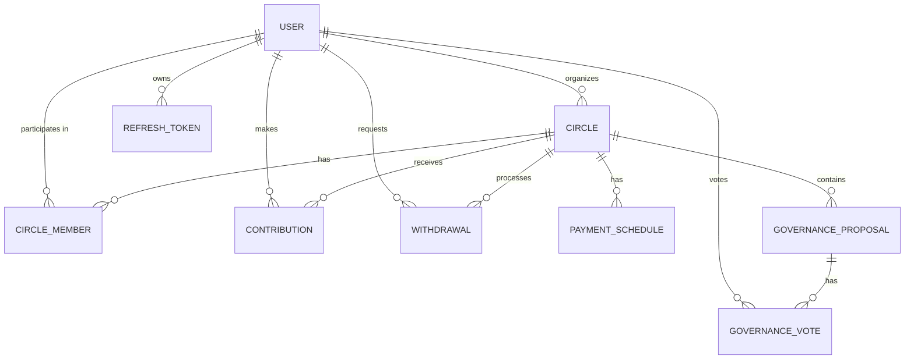

# Database Schema Documentation - Stellar Ajo

This document provides a comprehensive overview of the database schema for Stellar Ajo. The application uses **Prisma 5.x** as the ORM, with **SQLite** for development and **PostgreSQL** for production.

## Database Overview

- **Development Database**: SQLite (`file:./dev.db`)
- **Production Database**: PostgreSQL
- **ORM**: Prisma 5.x

---

## Models

### User

Stores user accounts and profile information.

| Field              | Type          | Notes                                                                         |
| :----------------- | :------------ | :---------------------------------------------------------------------------- |
| `id`               | String (cuid) | Primary key                                                                   |
| `email`            | String        | Unique                                                                        |
| `password`         | String        | bcrypt hash                                                                   |
| `walletAddress`    | String?       | Unique, Stellar public key                                                    |
| `nonce`            | String?       | One-time nonce for wallet signature verification; nullified after use         |
| `isWalletVerified` | Boolean       | Default `false`; set to `true` after successful wallet signature verification |
| `firstName`        | String?       |                                                                               |
| `lastName`         | String?       |                                                                               |
| `phoneNumber`      | String?       |                                                                               |
| `profilePicture`   | String?       | URL                                                                           |
| `bio`              | String?       |                                                                               |
| `verified`         | Boolean       | Default `false`; email verification flag                                      |
| `createdAt`        | DateTime      | Auto-set on create                                                            |
| `updatedAt`        | DateTime      | Auto-updated                                                                  |

**Relations:** `circles` (CircleMember), `organizedCircles` (Circle), `votes` (GovernanceVote), `contributions` (Contribution), `withdrawals` (Withdrawal), `refreshTokens` (RefreshToken)

---

### RefreshToken

Stores active refresh tokens for JWT rotation.

| Field       | Type          | Notes                     |
| :---------- | :------------ | :------------------------ |
| `id`        | String (cuid) | Primary key               |
| `token`     | String        | Unique UUID               |
| `userId`    | String        | FK → User, cascade delete |
| `expiresAt` | DateTime      | 30 days from creation     |

**Index:** `userId`

---

### Circle

Represents a savings circle.

| Field                       | Type          | Notes                                       |
| :-------------------------- | :------------ | :------------------------------------------ |
| `id`                        | String (cuid) | Primary key                                 |
| `name`                      | String        |                                             |
| `description`               | String?       |                                             |
| `organizerId`               | String        | FK → User, cascade delete                   |
| `contributionAmount`        | Float         | Amount each member contributes per round    |
| `contributionFrequencyDays` | Int           | Default `7`; days between rounds            |
| `maxRounds`                 | Int           | Default `12`; total number of payout rounds |
| `currentRound`              | Int           | Default `1`; increments each round          |
| `status`                    | CircleStatus  | Default `ACTIVE`                            |
| `contractAddress`           | String?       | Soroban contract address once deployed      |
| `contractDeployed`          | Boolean       | Default `false`                             |
| `createdAt`                 | DateTime      | Auto-set                                    |
| `updatedAt`                 | DateTime      | Auto-updated                                |

**Indexes:** `organizerId`, `status`
**Relations:** `members` (CircleMember), `contributions` (Contribution), `payments` (PaymentSchedule), `governance` (GovernanceProposal), `withdrawals` (Withdrawal)

---

### CircleMember

Join table between User and Circle, tracking each member's participation.

| Field               | Type          | Notes                                |
| :------------------ | :------------ | :----------------------------------- |
| `id`                | String (cuid) | Primary key                          |
| `circleId`          | String        | FK → Circle, cascade delete          |
| `userId`            | String        | FK → User, cascade delete            |
| `status`            | MemberStatus  | Default `ACTIVE`                     |
| `rotationOrder`     | Int           | Unique; determines payout turn order |
| `hasReceivedPayout` | Boolean       | Default `false`                      |
| `totalContributed`  | Float         | Default `0`; running total           |
| `totalWithdrawn`    | Float         | Default `0`; running total           |
| `joinedAt`          | DateTime      | Auto-set                             |
| `leftAt`            | DateTime?     | Set when member exits                |

**Unique constraint:** `[circleId, userId]`
**Indexes:** `circleId`, `userId`, `status`

---

### Contribution

Records each contribution transaction.

| Field         | Type               | Notes                                  |
| :------------ | :----------------- | :------------------------------------- |
| `id`          | String (cuid)      | Primary key                            |
| `circleId`    | String             | FK → Circle, cascade delete            |
| `userId`      | String             | FK → User, cascade delete              |
| `amount`      | Float              | Contribution amount                    |
| `round`       | Int                | The round this contribution belongs to |
| `status`      | ContributionStatus | Default `PENDING`                      |
| `txHash`      | String?            | Stellar transaction hash               |
| `createdAt`   | DateTime           | Auto-set                               |
| `completedAt` | DateTime?          | Set when status becomes COMPLETED      |

**Indexes:** `circleId`, `userId`, `status`, `[circleId, status]`

---

### PaymentSchedule

Tracks the payout schedule for each round.

| Field            | Type          | Notes                              |
| :--------------- | :------------ | :--------------------------------- |
| `id`             | String (cuid) | Primary key                        |
| `circleId`       | String        | FK → Circle, cascade delete        |
| `round`          | Int           | Round number                       |
| `payeeIndex`     | Int           | Index into the rotation order      |
| `expectedAmount` | Float         | Total payout amount for this round |
| `dueDate`        | DateTime      | When the payout is due             |
| `status`         | PaymentStatus | Default `PENDING`                  |
| `paidAt`         | DateTime?     | Set when completed                 |
| `createdAt`      | DateTime      | Auto-set                           |
| `updatedAt`      | DateTime      | Auto-updated                       |

**Indexes:** `circleId`, `status`, `[circleId, status]`

---

### GovernanceProposal

Stores governance proposals for a circle.

| Field             | Type           | Notes                                             |
| :---------------- | :------------- | :------------------------------------------------ |
| `id`              | String (cuid)  | Primary key                                       |
| `circleId`        | String         | FK → Circle, cascade delete                       |
| `title`           | String         |                                                   |
| `description`     | String         |                                                   |
| `proposalType`    | ProposalType   | See enum below                                    |
| `status`          | ProposalStatus | Default `PENDING`                                 |
| `votingStartDate` | DateTime       | Set to `now()` on creation                        |
| `votingEndDate`   | DateTime       | Provided by creator                               |
| `requiredQuorum`  | Int            | Default `50`; minimum % of members that must vote |
| `proposalData`    | String?        | JSON string for type-specific data                |
| `createdAt`       | DateTime       | Auto-set                                          |

**Indexes:** `circleId`, `status`, `[circleId, status]`

---

### GovernanceVote

Records individual votes on proposals.

| Field        | Type          | Notes                                   |
| :----------- | :------------ | :-------------------------------------- |
| `id`         | String (cuid) | Primary key                             |
| `proposalId` | String        | FK → GovernanceProposal, cascade delete |
| `userId`     | String        | FK → User, cascade delete               |
| `voteChoice` | VoteChoice    | YES, NO, or ABSTAIN                     |
| `createdAt`  | DateTime      | Auto-set                                |

**Unique constraint:** `[proposalId, userId]` — one vote per user per proposal
**Indexes:** `proposalId`, `userId`

---

### Withdrawal

Records partial withdrawal requests.

| Field               | Type             | Notes                                    |
| :------------------ | :--------------- | :--------------------------------------- |
| `id`                | String (cuid)    | Primary key                              |
| `circleId`          | String           | FK → Circle, cascade delete              |
| `userId`            | String           | FK → User, cascade delete                |
| `amount`            | Float            | Net amount after penalty                 |
| `requestedAmount`   | Float            | Original amount requested before penalty |
| `penaltyPercentage` | Float            | Default `10%`                            |
| `reason`            | String?          | Optional reason provided by member       |
| `status`            | WithdrawalStatus | Default `PENDING`                        |
| `txHash`            | String?          | Stellar transaction hash                 |
| `createdAt`         | DateTime         | Auto-set                                 |
| `approvedAt`        | DateTime?        |                                          |
| `completedAt`       | DateTime?        |                                          |

**Indexes:** `circleId`, `userId`, `status`, `[circleId, status]`

---

### Session

Legacy session storage (JWT-based auth uses RefreshToken instead).

| Field       | Type          | Notes       |
| :---------- | :------------ | :---------- |
| `id`        | String (cuid) | Primary key |
| `userId`    | String        |             |
| `token`     | String        | Unique      |
| `expiresAt` | DateTime      |             |
| `createdAt` | DateTime      | Auto-set    |

---

## Enums

| Enum                 | Values                                                                                     |
| :------------------- | :----------------------------------------------------------------------------------------- |
| `CircleStatus`       | PENDING, ACTIVE, COMPLETED, CANCELLED                                                      |
| `MemberStatus`       | ACTIVE, INACTIVE, EXITED, SUSPENDED                                                        |
| `ContributionStatus` | PENDING, COMPLETED, FAILED, REFUNDED                                                       |
| `PaymentStatus`      | PENDING, INITIATED, COMPLETED, OVERDUE, FAILED                                             |
| `ProposalType`       | RULE_CHANGE, MEMBER_REMOVAL, EMERGENCY_PAYOUT, CIRCLE_DISSOLUTION, CONTRIBUTION_ADJUSTMENT |
| `ProposalStatus`     | PENDING, ACTIVE, PASSED, REJECTED, EXECUTED                                                |
| `VoteChoice`         | YES, NO, ABSTAIN                                                                           |
| `WithdrawalStatus`   | PENDING, APPROVED, REJECTED, COMPLETED, CANCELLED                                          |

---

## Entity Relationship Summary



---

## Common Prisma Commands

```bash
# Generate client after schema changes
pnpm prisma generate

# Create and apply a new migration
pnpm prisma migrate dev --name <migration-name>

# Apply migrations in production (no prompt)
pnpm prisma migrate deploy

# Reset database (dev only — destroys all data)
pnpm prisma migrate reset

# Open Prisma Studio to browse data
pnpm prisma studio

# Seed the database
pnpm prisma db seed
```
